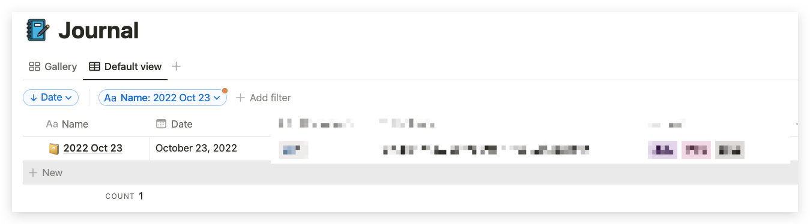
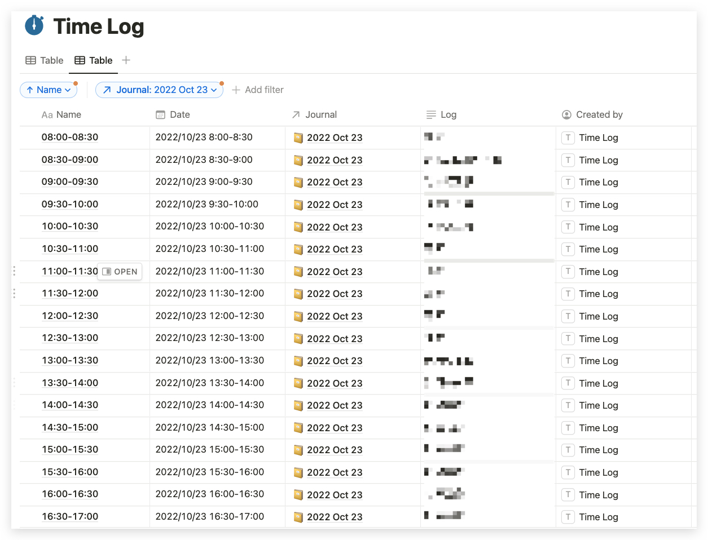

# Notion Journal and Timelog
A tool to create my notion journal pages and timelog pages which are related to my journal.

This tool creates
1. One Journal page 
2. 34 TimeLog pages (One page every 0.5h from 07:00 - 08:00)


## Set up
### 1. Prepare Databases
Prepare these two database with at least the columns shown below. 

| Database | Column Name | Column Type | Note |
| ------------- | :----------- | :----------- | --- |
| 1. Journal       | Name        | Text        | 
|               | Date        | Date        |
| 2. Time Log      | Name        | Text        |
|               | Date        | Date        |
|               | Journal     | Relation    | Relation to the Journal Database

### 2. Create the `.env` file

```
cp .env.example .env
```

### 3. Paste your notion keys and DB_ID to the `.env` file

```
NOTION_KEY=
TIMELOG_DB_ID=
JOURNAL_DB_ID=
```

### 4. Install Dependencies
```
npm install
```

## Execute
```
node index.js
```
- Default date is set to current date. You may also specify a certain date as below
```
node index.js 2022-10-24
```

## Result


